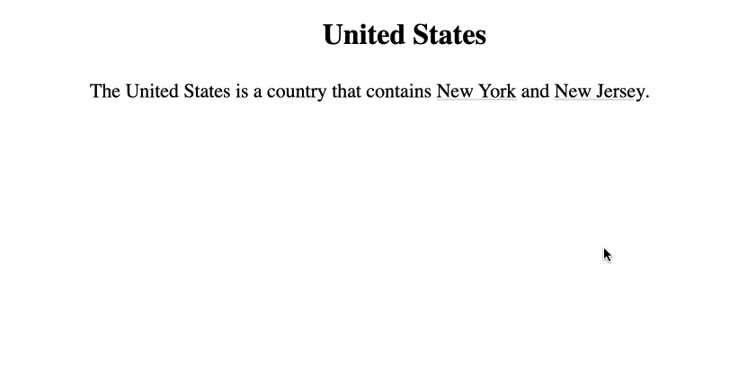
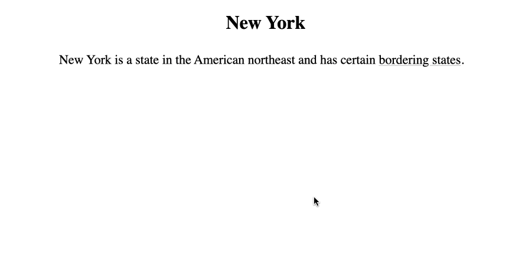

<div align="right">
<a href="https://en.wikipedia.org/wiki/Canopy_(biology)#/media/File:JigsawCanopy.jpg">
</a>
<sub>
  <a rel="nofollow" class="external text" href="https://markfisher.photo">Mark Fisher - markfisher.photo</a>,
  <a href="https://creativecommons.org/licenses/by-sa/3.0" title="Creative Commons Attribution-Share Alike 3.0">CC BY-SA 3.0</a>,
  <a href="https://commons.wikimedia.org/w/index.php?curid=18189052">Link</a>
</sub>
</div>
<div align="center">
<h1>Canopy.js</h1>
<p> Make interactive websites from your prose explanations. <b><a href="#">Demo</a></b></p>
</div>

# Table of Contents

- [Table of Contents](#table-of-contents)
  * [About Canopy JS](#about-canopy-js)
    + [What Canopy does](#what-canopy-does)
    + [Motivations](#motivations)
      - [1. Explanation is the traversal of a graph](#1-explanation-is-the-traversal-of-a-graph)
      - [2. Explanations can be very large](#2-explanations-can-be-very-large)
      - [3. Explanations are mergable](#3-explanations-are-mergable)
      - [4. Every idea is a unique address](#4-every-idea-is-a-unique-address)
      - [5. Explanatory data is metadata](#5-explanatory-data-is-metadata)
      - [6. Memory requires hierarchy, so data should be hierarchical](#6-memory-requires-hierarchy--so-data-should-be-hierarchical)
      - [7. Mastery requires dense graphs, which are hard to serialize](#7-mastery-requires-dense-graphs--which-are-hard-to-serialize)
      - [8. References are intended to import, not redirect](#8-references-are-intended-to-import--not-redirect)
      - [9. The page represents the state of the explanation](#9-the-page-represents-the-state-of-the-explanation)
      - [10. Visual memory is stronger than verbal](#10-visual-memory-is-stronger-than-verbal)
  * [Getting Started](#getting-started)
    + [Installation](#installation)
    + [Quickstart](#quickstart)
    + [Data Model](#data-model)
    + [CLI](#cli)
  * [Development](#development)
    + [Developer Installation](#developer-installation)
    + [Running Tests](#running-tests)
    + [Run Webpack](#run-webpack)

## About Canopy JS

### What Canopy does

Canopy takes a set of text files like this:


```
United States: The United States is a country that contains [[New York]] and [[New Jersey]].

New York: New York is a northeastern American state whose capital is [[Albany]].
New York has 20.2 million people, and contains New York City.
New York covers a total area of 54,556 square miles.

Albany: Albany is a mid-sized American city in upstate New York.

New Jersey:   New Jersey is a northeastern American state whose capital is [[Trenton]].
New Jersey has 9.3 million residents. The state was a major site of the American Revolutionary War,
and later became a center of manufacturing and immigration.

Trenton: Trenton is a mid-sized American city in southern New Jersey.

```
And produces an interactive website like this:
<br>
<br>
<br>



<br>
<br>
<br>
<br>
Traverse the same content in different directions:
<br>
<br>
<br>
<br>



### Motivations

Canopy JS is motivated by several observations and design goals.

#### 1. Explanation is the traversal of a graph

When an expert produces an explanation, they are taking their interconnected knowledge and producing a partial linearization of it for some specific audience and purpose, creating a new composition from a set of reusable parts. This linearization can occur up-front, when the author produces a book or lecture. Or, the expert can answer questions, producing small linearizations in response to specific requests. This type of customized explanation can include more clarification for a beginner, more detail for someone advanced, or connections from the material to the interests and background knowledge of the listener. Customization, however, requires continued access to the explainer. So, rather than having the expert produce a single text, the author might instead record the graph itself, allowing the user to produce linearizations on their own, customized to their interests, without being dependent on the time of the instructor.

#### 2. Explanations can be very large

There are practical limitations to the length of a book, or the size of a lecture, but explainers have the ability produce explanations that are much larger than this. A professor can explain the material of an entire course. A domain expert can explain an entire discipline. Producing large explanations like these as one unit might confer certain benefits. A singly-authored work would have a common vocabulary and consistent approach that might make it easier to assimilate the various pieces. Such a work might also capture the subtle decisions an expert makes in choosing how to structure their private understanding of the corpus as a whole. Yet dealing with large explanations presents logistical difficulty. At the moment, they are hard to produce, and they are also hard to consume. It would take too long to find things in them manually, and beyond a certain scale, even the indexes and tables of contents would become too large to navigate. Yet perhaps we can borrow a helpful finding from computer science, which is that trees scale much more gracefully than lists. By composing large explanations out of a graph of interrelated trees, even a set with millions of paragraphs could be navigated in just a handful of steps. So, by making it tractable to consume such large explanations, we might enable new kinds of "writing in the large" that haven't been previously possible.

#### 3. Explanations are mergable

When we read several books on the same subject, most of us would be hard pressed to recall the exact ordering of the original sources. Yet we would generally remember, regarding a given point, who said what. Thus, in the process of reading, we are "merging" the source texts, identifying points in common and facts that regard the same thing, and putting them all together in our minds. An expert might have done this for all of the writings of their discipline. Having access to such a structure could give us the lay of the land of a wide domain without the exclusive bias of any single party. Yet capturing the result of such a process in writing is difficult. It would be very large, composed of many nested back-and-forths, and given limited space, one would have to make controversial decisions about which points to expand on or mention first. Graph-based approaches don't have these difficulties, as graphs are already non-linear, inherently have no order or favoritism, and adding to one topic doesn't remove space or attention from another. Thus, graph-based mediums create the possibility for new types of source analysis and bibliography, ones that fully digest other works and put them in conversation point by point, without having to take sides through emphasis or priority.

#### 4. Every idea is an entity

When we make speak about texts, we refer to books and articles, or specific chapters and sections. Yet every idea is an entity, fitting to be referenced individually, and to have its own connections and prerequisites individually. So, we can make the unit of explanation the single idea, giving each idea a name and address, and at that address, put an explanation that will impart the idea and its prerequisites, and listing other related points that are available. Thus would we increase the precision with which we can store explanations, the precision with which people can request them, and the precision with which explanations themselves can make internal reference from one part to another.

#### 5. Explanatory data is metadata

In a library, you have books and bookshelves. A bookshelf represents a category, and the books are the items that get put in the category. But in explanation, it isn't like that. A certain point can be both book and bookshelf, a "book", to be stored in a category among related points, but also a "shelf", to be a place where additional information can be stored. We see this occur in speech, where we mention a given topic both in order to discuss it, but also to navigate to related topics. Thus, we could mimic this approach and use explanation as the classification scheme for explanation, making natural language points be the structure of classification scheme. Additionally, whereas some mediums must artificially limit the length and scope of content to fit within a fixed classification scheme, one fixed-length page per topic name for example, graph data is the opposite, having more surface area of nooks and crannies at which to store things as the total number of things increases. With that greater surface area comes the ability to include certain kinds of analysis more ubiquitously, etymologies for every word, the historical development of every idea, allowing every particular point to tap into general reusable explanation stock. There may be basic points that bear upon well-known ideas that have never reached circulation because there has been no way to put them adjacent to the point in question, and no place in turn to put points bearing on them, and so on, suggesting a much greater depth of analysis than has currently been possible.

#### 6. Memory requires hierarchy, so data should be hierarchical

Most writing takes the form of a list, one idea following another on a related theme. Yet lists are hard to remember. There is a limit to the size of what we can consider at one time in working memory, and things not seen together in that window don't get connected, and so after hearing a list of ten things, a person might have understood every one of them, but have no way of recalling the list itself. What people do remember are trees – a box with a few items can be seen as a whole and remembered, and then I can inspect each item and remember its parts, and their parts, and thereby I can store unlimited information while only ever dealing with one image at a time. Experts also have vast hierarchy, nicknames and intermediary groupings for things, but they usually omit these from their public explanations, thus depriving the audience of the very information that they will need to recall the data. To prevent this, we can disallow lists, and require that explanations be composed of small explicitly-connected units, and when one gets too large, require it be broken into smaller pieces, and require that each new paragraph have been referenced by some prior one, such that we end up with a tree of paragraphs, descending from the general to the specific, providing the reader with a structure of small memorable chunks that can be internalized as-is. Such a structure would be self-summarizing, as any earlier subset forms a summary of everything else that is downriver. One without time to consume the whole thing can also rest assured that whatever subset they do see, if consumed top-down, will reflect the broadest conception possible given their time constraints, unlike a book or lecture where one will go into depth on certain subjects before even hearing about certain others, making it difficult to leave early.

#### 7. Mastery requires dense graphs, which are hard to serialize

Two people can know the same facts, but interact with them with varying degrees of comfort and flexibility. What distinguishes the expert is that they not only know many things, but they have many connections between them – one fact requires another, one event preceded another – and not only can they derive these relations, but very often they have already derived them and have them committed to memory, often in multiple places, to be accessed instantly regardless of the subject at hand. What results from this is a dense graph where every node has many edges. Yet dense graphs are very difficult to serialize, especially in narrative which prefers forward-driving action to combinatorial interrelation. Additionally, when pressed for time or paper, authors have had to write only the essential facts, requiring the reader to "unpack" them, to find derivative points and enumerate interconnections. Yet, there are many who would benefit from these rich edges who do not have the time or ability to derive them personally. Thus, there is very likely a chronic under-supply of this interconnective data in existing explanatory mediums. A solution would be to have the expert capture and produce their internal graph itself, so that consumers have the ability to explore the redundant connections that form mastery at their leisure.

#### 8. References are intended to import, not redirect

Most links on the internet redirect the user to a new "location", with a new address and visual context. Yet this does not seem like the intention of most natural language references. When I am speaking about a certain topic and reference something else, I usually do not intend to suggest we change the subject to that thing, but rather I wish to "import" that concept here, ensuring familiarity with it in order for me to make some local point. Yet the user experience of the web doesn't reflect this at all, sending me ten different places for ten things that might all be part of the same point. The alternative is to have the primary effect of hyperlinks in explanation be the addition of information to the current page, rather than redirection. This mimics the way in which a conversation "unfolds", staying moored to the original topic while wandering at the edges in different directions.

#### 9. The page represents the state of the explanation

When a newcomer enters a conversation that is already in progress and is "brought up to speed", we usually don't recount for them the entirety of what was said previously. For them to be able to follow, it is usually enough to trace through some smaller number of prior points for them to understand the current topic. Thus does an explanation or conversation have "state", a particular configuration in its progress that is not the same thing, and is simpler, than our position in its entirety. By representing every explanation as a series of small paragraphs that make one point and introduce several others, every position in the explanation can be expressed as a node in a tree. Paragraphs in books and articles are like this too, only relevant in so far as they address a thing mentioned in a previous paragraph, which itself  was mentioned in a previous paragraph. Yet because books have the dual-responsibility both of communicating information clearly and also packing it together efficiently, the sequence of paragraphs must represent a hodge-podge of different connections, often implicitly, and it can be easy for someone to lose the chain of how a particular point connects to the original question. Digital mediums give us the ability to decouple these traditional roles, allowing the visible page to represent only the path from the original topic to the current point, without also having to represent the total set of points available. Thus can we achieve a new level of clarity, allowing the path of relevance to be the physical structure of the page, drilling into the mind of the reader how we got to the point in question, and hopefully making it more recallable via that path in future.

#### 10. Visual memory is stronger than verbal

It is possible to remember a large number of facts, but it is much easier to remember the contents of physical spaces. Visual memory is much quicker to internalize a fact, and it is much easier to recall from when needed. Yet prose explanation hardly takes advantage of this vast cognitive resource, presenting what is visually a long one-dimensional list of points. Instead, by laying explanation out over two-dimensional space, with this point connected to that point, and with this point the means to access another, we might be able to double-encode our verbal knowledge as spatial, and might greatly buttress thereby our ability to recall and navigate explanation.

## Getting Started

### Installation

Install CLI:

```
npm install -g canopy-js
```

### Quickstart

Get your project going

### Data Model

There are categories, topics, and subtopics, and global references, local references, and import references.

### CLI

The Canopy CLI has various commands

## Development

### Developer Installation

For development, clone the repo and run

```
npm install -g [PATH TO REPO]
```

And for help remembering to increment the package.json version number when pushing tags, symlink the git push hook:
```
ln -s script/hooks/pre-push .git/hooks
```
### Running Tests

Run tests:
```
npm run test
```

For just unit tests:

```
npm run jest
```

For just Playwright:
```
npx playwright test
```

### Run Webpack

To build assets from the client codebase run:
```
npm run develop
```
