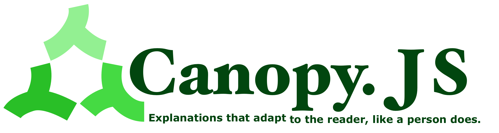
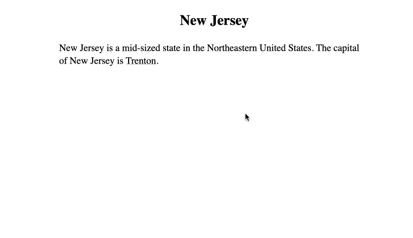
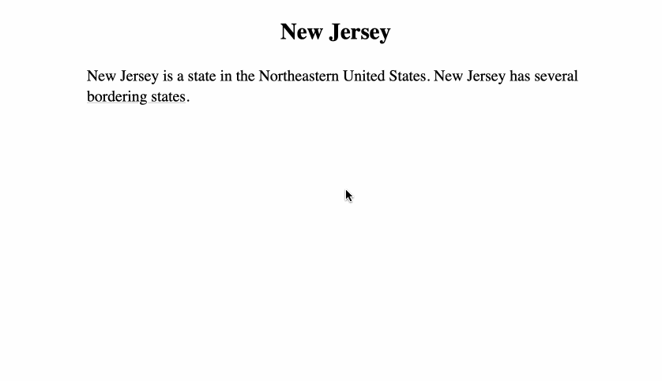
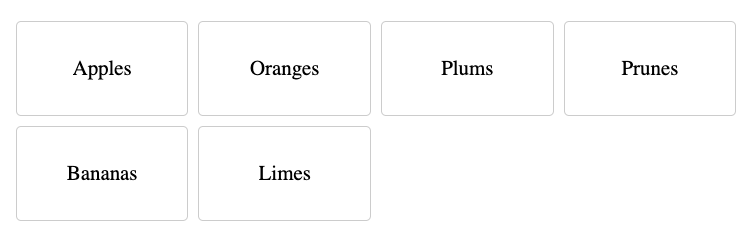
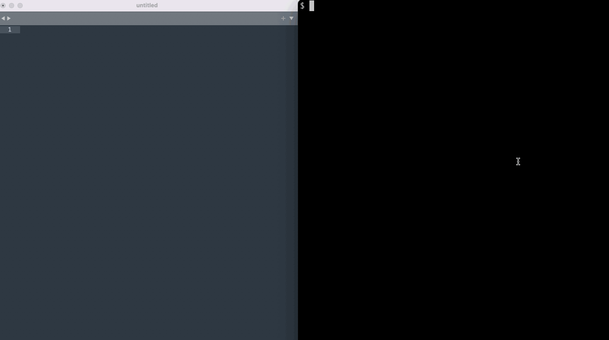

<div align="right">
<a href="https://en.wikipedia.org/wiki/Canopy_(biology)#/media/File:JigsawCanopy.jpg">
</a>
<sub>
  <a rel="nofollow" class="external text" href="https://markfisher.photo">Mark Fisher - markfisher.photo</a>,
  <a href="https://creativecommons.org/licenses/by-sa/3.0" title="Creative Commons Attribution-Share Alike 3.0">CC BY-SA 3.0</a>,
  <a href="https://commons.wikimedia.org/w/index.php?curid=18189052">Link</a>
</sub>
</div>
<div align="center">
<br>



<br>
</div>

## See the new playground

Check out the new [interactive playground here](https://playground.canopyjs.org). Questions or comments: `hello at canopyjs dot org`.

## What Canopy does

Canopy takes a set of text files like this:


```
United States: The United States is a country that contains [[New York]] and [[New Jersey]].

New York:
New York is a northeastern American state whose capital is [[Albany]].
New York has 20.2 million people, and contains New York City.
New York covers a total area of 54,556 square miles.

Albany: Albany is a mid-sized American city in upstate New York.

New Jersey:
New Jersey is a northeastern American state whose capital is [[Trenton]].
New Jersey has 9.3 million residents. The state was a major site of the American Revolutionary War,
and later became a center of manufacturing and immigration.

Trenton: Trenton is a mid-sized American city in southern New Jersey.

```
<br>
And produces an interactive website like this:
<br>
<br>
<br>


<br>
<br>
<br>
<br>
<br>
<br>
<br>
Traverse the same content in different directions:
<br>
<br>
<br>
<br>


<br>
<br>
<br>
<br>
<br>
<br>

## Why?

A human expert can adapt to the listener, catering to their interests, adding more background for a beginner or more detail for one advanced. Multiple explanations may mention the same points, but in different contexts and orderings. Even though the same building blocks are being used, you'll never hear exactly the same explanation twice.

Canopy allows an author to express their ideas once in small modular pieces, which the interface then combines to produce an infinite number of customized, user-driven explanations. Projects of enormous size can be navigated in just a few clicks. Each self-contained point can reference many more, better capturing the web of connections that can exist between topics of a subject area.

## Example flow

Here we use the CLI "bulk mode" to define several "topics" and then view them in the web view:


<br>
## Demo

Read a partial draft of this documentation written in Canopy as a demo **[here](http://canopyjs.org)**.

## Getting Started

These are instructions for people wishing to start their own Canopy project.

### Web Editor Installation

If you would like to create and publish a project using only the Github web interface, you can follow the instructions on the [Canopy project template repo](https://github.com/canopy-js/template-repo).

### Command-line Installation

Install the CLI:

```
npm install -g canopy-js
```

To start a Canopy project, first create a project directory and enter it:
```
mkdir myProject
cd myProject
```
Then, run the `canopy init` command:
```
canopy init
```
You will be asked for a default topic name, this tells the web application what paragraph to show the user first. It will be stored in the `canopy_default_topic` file in case you need to edit it later.

The init command should create a directory called `topics`, and a file like `myProject/topics/Category/My_Default_Topic.expl`.

A Canopy project is edited by creating new `.expl` files in the project's `topics` directory.

## Creating Content

Now that you've initialized a Canopy project, it is time to start adding content. (This section will explain the way content is created manually, but most people will find it easier to use the [bulk mode](https://github.com/canopy-js/canopy-js#using-bulk-mode) described afterwords. If you are using the [web editor installation method](https://github.com/canopy-js/canopy-js#web-editor-installation) mentioned above, then you will also be using bulk mode.)

### Creating Topic Files

A Canopy website is composed of named paragraphs, some of which are called "topics," and some of which are called "subtopics."

Topics are standalone "conversation-starters" which can be displayed as the first paragraph of a page, whereas subtopics are paragraphs that are part of a larger topic and should only be displayed after a certain path of prior paragraphs that are necessary for introduction. A Canopy project is composed of a flat set of topics, each of which can contain an internal tree of subtopics.

Every topic in a Canopy project has its own file with a `.expl` extension in the top-level `topics` directory. The name of the file and the directory structure within the `topics` folder do not affect site behavior, but it is helpful to put all topic files into one or more levels of "category" subdirectories within the `topics` directory, and to name topic files after the topic they contain.

A topic file is composed of a series of "paragraph nodes" and notes.

A paragraph node is a paragraph that begins with a "key," a title for the paragraph that is terminated by a colon or question-mark and followed by the text of the paragraph. A note is a paragraph that lacks a key, and notes are ignored by the build process. Paragraph nodes and notes should be separated by two newlines. For example:

```
Topic 1: This is the paragraph for Topic 1. The key of this paragraph is "Topic 1".

Subtopic 1: This is a subtopic of Topic 1. The key for this paragraph is "Subtopic 1".

This key is a question? And it is also a subtopic of Topic 1. The key for this paragraph is "This key is a question?"

This is a note. It has no key.

```

Paragraphs that have keys are called "nodes" because they will be part of the tree of paragraphs displayed to the user, as opposed to notes which are not displayed to the user.

The first paragraph node of the file represents the topic of that file, and all subsequent paragraph nodes are subtopics of that topic.

Paragraph nodes or notes can span multiple lines connected by single newline characters and still be considered one unit, so long as you do not use a double newline, which indicates a new paragraph or note. For example:

```
Topic 1: This is the paragraph for Topic 1.
This is a second line of the paragraph for Topic 1.

Subtopic 1: This is a new paragraph node for Subtopic 1.

```

At present, single newlines within a paragraph node are ignored, and all lines are concatenated to produce the paragraph displayed to the user.

Subtopic paragraphs should have names that are unique among the subtopics of their enclosing topic file, and topics should have a name that is unique among the topics of the project at large.

### Creating Links

Links or "references" are how it is possible to go from the original topic paragraph to other paragraphs in the project.

If `paragraph A` has a link to `paragraph B`, that means the user can select the link to `B` in order to add `paragraph B` to the page below `paragraph A`.

Links are made using the `[[Topic]]` syntax, using the name of another topic or subtopic to specify the target of the link, and one can change the link text like so: `[[Real Topic|Link Text]].` Link targets are case-insensitive and ignore style characters, so eg `[[_topic_]]` would be a valid reference to a topic with the key `Topic:`.

There are three types of references: local, global, and path references which are a type of global reference.

#### Local References

A local reference connects a topic to one of its subtopics, or connects a subtopic to another subtopic of the same topic. Local references cannot reference subtopics of other topics, or other topics of the project.

One makes a local reference by referencing a named paragraph that exists in the same file as the reference:

```
Topic 1: This is the root topic, and this is a link to [[Subtopic 1]].

Subtopic 1: this is a subtopic defined in the same file as the reference.
```

When a local link is selected, the child paragraph is displayed below the parent. There is no option to display it on its own as the root of a new page, because a subtopic is something that requires the context of the given topic to be understood.

For example, if one writes the following `expl` file:

```
New Jersey: New Jersey is a mid-sized state in the Northeastern US. The capital of New Jersey is [[Trenton]].

Trenton: Trenton is the capital of New Jersey, and its legislature is housed in the [[New Jersey State House]].

New Jersey State House: The New Jersey State House was built in 1792.
```

It will produce the following website:



The topic paragraph can reference several subtopics, which in turn can reference several other subtopics, forming a tree. To maintain this tree structure, each subtopic can only be referenced by one "parent" paragraph.

(If you want to have two references to a given subtopic from different subtopics of that topic, you can make the target subtopic a topic proper, or use the "import reference" functionality described below.)

#### Global References

A global reference connects a topic or subtopic to an entirely different topic. A global reference can only refer to the "root" topic paragraph of a topic, and not to one of the internal subtopics it contains.

To make a global link, we reference a topic defined in a different file:

```
Topic 1: This is a paragraph defined in a file called Topic_1.expl.
We are going to reference [[Topic 2]], which is defined in a file called Topic_2.expl.
```

```
Topic 2: This is a paragraph defined in a file called Topic_2.expl.
When you click on the link in the previous paragraph, this paragraph will be displayed below it.
```


For example, the following `expl` files in the topics directory:

```
New Jersey: New Jersey is a state in the Northeastern United States. New Jersey has several [[bordering states]].

Bordering states: New Jersey shares its northern border with [[New York]].
```

```
New York: New York is a large state in the Northeastern United States. New Jersey has several [[bordering states]].

Bordering states: New York shares some of its southern border with [[New Jersey]].
```

Produce the following website:
<br>


<br>
<br>

As pictured above, when a global link is selected, the user has the option of appending the new paragraph below the current one, or, the user may press "return" or "alt/option-click" and be redirected to a new page containing only the target topic paragraph, allowing one to start a new session.

Unlike a subtopic which can only be referenced from within a paragraph of its topic file, a topic can be referenced from any paragraph of any file in the project.

#### Path references

A path reference can be made like so:

```
Wyoming: Wyoming is a midwestern state, similar to [[USA/Idaho#Boise]].
```

```
USA: The USA is a country, which contains [[Idaho]].

```

```
Idaho: Idaho is a midwestern state, whose capital is [[Boise]]

Boise: This is the capital.
```

Selecting such a link will display multiple paragraphs below the current one.

#### Cycle references

Cycle references are when a reference points to a topic that is already displayed in the current path. In such a case, the link offers the user a redirecting scroll backwards to the original instance, followed possibly by an advance to the new subsequent position. Eg, if the user is at path `A/B/C` and they click a link pointing to `B/D`, they will be scrolled up to `B`, and then down to `D`. Whether a link is a cycle link or not depends on the current path.

One common use of path references is to take the user back to a previous list. So, the user might be at path `List/1`, and I might link to `List/2` rather than directly to `2`, which causes the user to return up and forward to `List/2`, rather than downward to `List/1/2` all displayed sequentially on the screen.

Examples of cycle references can be found in the Canopy playground mentioned above.

#### Path shorthands

If you want to create a path reference which references another subtopic in the same topic, you can use the omitted topic syntax like this: \[\[#Subtopic\]\]

Conversely, if you would like to clarify that you mean a reference as a global reference even though it corresponds also to a subtopic of the current topic, you can use the omitted subtopic syntax: \[\[Topic#\]\].

Lastly, a simple \[\[#]] or \[\[#|Back]] is similar to both previous examples, like the first in that the omitted topic implies the reference should point at the current topic, and like the second in that the omitted subtopic implies the reference should point to the topic's topic-subtopic ie the paragraph of the topic's root key. Such a link in effect is a natural back button because a link to the subtopic's topic becomes a cycle reference that when clicked, retraced and closes the subtopic chain until the topic root, and selects the topic's parent link, allowing the user to navigate to other links of the parent paragraph.

#### Advanced link syntax ####

If you want to make the link target and display text different from one another, there are several syntaxes you can use:

| Syntax name | If you write | Target name will be | Display text will be |
|-------------|--------------|-------------------------|--------------------------|
| Simple | \[\[target name\|display text]] | target name | display text |
| Exclusive display | \[\[{the answer} to the question]] | the answer to the question | the answer |
| Exclusive target | \[\[{{dog}}s]] | dog | dogs |
| Interpolation | \[\[harmon{y\|ies}]] | harmony | harmonies |
| Mix | \[\[{the \|a }US {postal service}]] | the US postal service | a postal service |

If an exclusive syntax is used multiple times, the instances will be concatenated, as will interpolation syntax when combined with either syntax.

You can remember the order of the interpolation syntax by thinking of every `{x|y}` unit as being a microcosm of the simple link syntax ie `[[Target name|Display text]]` where the text before the pipe is the real target and the text after is the display text.

Explicit import reference syntax ie `[[A#B]]` can be used in conjunction with any of these syntaxes, you would just need to make the "target" name end up as `A#B`. If you write \[\[A#B]], Canopy knows to make the display text `B` and not the literal `A#B`, but if you use any custom syntax, you are responsible for making the target evaluate to `A#B` and the display text evaluate to the correct substring, because `#` characters in the display text will be interpreted literally and displayed.

### Using Markup

Usual markdown-style styling is generally available.

#### Lists ####
```
1. This is a list.
  a. This is a subpoint
```
#### Fenced code blocks ####
````
```
if (x) y(); //This is a code block
```
````
#### Prefix code blocks ####
````
`
` if (x) y(); //This is a code block
`
````
#### Tables ####
````
| This | is | a | table |
|------|----|---|-------|
|  A   | B  | C |   D   |
````

#### Table lists ####
````
===
- Apples
- Oranges
- Plums
- Prunes
- Bananas
- Limes
===
````



#### Block quotes ####
````
> This
> is
> a
> block
> quote
````
#### RTL block quotes ####
````
This is regular text.
< המילים האלה
< הן מימין לשמאל
More text.
````
#### Footnotes ####
````
This is text with a footnote[^1].
[^1]: This is the footnote.
````

#### Images ####

```


```

Any inline-token such as Canopy references can be used in the image caption.

By default images link to their sources.

#### Linked Images ####

```
[](http://hyperlink-target.com)
```

#### Style characters ####
````
This text is *bold*, _italic_, `code snippet`, ~strike through~.
````
#### HTML ####
````
This is text with some <b> HTML </b> mixed in.
````
### Using Bulk Mode

It can become tedious to create `expl` files manually, so the CLI has a feature called "bulk mode" which allows the user to create and edit many topic files by editing a single "bulk file" representing part or all of their project files. A bulk file might look like this:

```
[Category A]

* Topic 1: This is a file with the topic key "Topic 1".

Subtopic: This is a subtopic of Topic 1, in the same file.

* Topic 2: This is a file with the topic key "Topic 2".

Subtopic: This is a subtopic of Topic 2, in the same file.

[Category A/Category B]

These are notes.

```

Text in square brackets defines a directory path, and text after a `*` character represents a new file, which will be named after the given topic key.

The bulk file shown above would represent the existence of a directory `topics/Category_A` that contained two files, `topics/Category_A/Topic_1.expl` and `topics/Category_A/Topic_2.expl`, and a second directory `topics/Category_A/Category_B` that contained the file `topics/Category_A/Category_B/Category_B.expl`. (If you create notes in bulk mode that don't belong to any particular file, they will be added to a "category notes" file named after the enclosing folder. Files that contain only notes have no topic and are ignored by the parser.)

For example:


You can run `canopy bulk` to start a bulk session in your default editor. If you want to use a visual editor like Sublime Text, you can run `CANOPY_EDITOR='subl -w' canopy bulk` to temporarily set your editor, or, you can add `export CANOPY_EDITOR='subl -w'` to your shell config file. (In the absence of a `CANOPY_EDITOR` environment variable, Canopy will check for `VISUAL` and then `EDITOR`.) When you close the editor, your bulk file will be "processed," updating the topic files of the `topics` directory to reflect the changes you made in the bulk file.

If you want to create a bulk file and edit it at your leisure, processing it at a later point, you can run `canopy bulk --start` to begin, and then `canopy bulk --finish` to process.

If you want to open an editor and make changes in an ongoing fashion, periodically saving changes and watching the result load in the browser, you can run `canopy bulk --sync`. It is recommended to use a visual editor for this so that you can see the session logs in the terminal.

For example:



To load only certain files or directories, use `canopy bulk -pd` for a directory picker, `canopy bulk -pf` for a file picker, and `canopy bulk -pr` to chose directories and all their contents recursively. You can also use `canopy bulk --search STRING` to include topic file paths matching a search string, `canopy bulk --git` to include all files changed relative to the last git commit, or `canopy bulk --blank` to start with an empty file.

### Building your project

In order to produce our website, we need to convert our `expl` files in the `topics` directory into `html` and `JSON` for the browser. Run `canopy build` to build JSON files from your `expl` files in the project-level `build` directory.

Build has a few options: If you are going to host your site at a subpath like `example.com/subpath/Project`, then you can build with `canopy build --project-path-prefix subdirectory`. If you want to host your site on a static assets server, you can build with hash URLs (eg `example.com/#/Topic`) using `canopy build --hash-urls`, and then host a static assets server pointing at the build directory.

If you create an `assets` directory in your project folder, the build script will copy it to an `_assets` directory in your build directory, allowing your `expl` files to make references to assets like `_assets/img.png`. A `favicon.ico` file in your `assets` directory will cause your project's automatically generated `index.html` file to include it. (The leading underscore is necessary to avoid collision with topics named `assets`.) If you create an `assets/custom.css` file it will get included in the index.html page. Create a `head.html` file for content you want loaded in the page's head, `assets/nav.html` for content that goes above the Canopy.js interface, and `assets/footer.html` for things to be put under the UI in the body.

If you want to make a custom page, you can use the `canopy build --manual-html` and `--keep-build-directory` options to write your own `index.html` and and incorporate Canopy into it. Canopy.js is expecting a DOM element with the id '\_canopy', and that element should have data attributes called `data-default-topic`, and optionally `data-project-path-prefix`, and `data-hash-urls` for the options described above. In addition, your `index.html` page should have a `script` tag that requires the `canopy.js` asset that you can find in the `dist` directory of the `npm` install, or on the `dist` directory of the `build` branch of this repository.

### Watching your topic files

You can watch your `topics` directory for changes and rebuild the JSON files automatically on change using the `canopy watch` command. Canopy watch should take the same options as build, so that you can specify how you want it to build your project. You can run the command in the background using `canopy watch &`.

### Serving the web interface

You can run a Node.js Express server for your project using `canopy serve` followed by an optional port parameter. Alternatively, you can build with the `--hash-urls` argument option, which allows the site to be hosted with any static assets server.

### Keyboard shortcuts

You can use a Canopy website using only the keyboard.

| Key | Action |
------|---------
| Up, k  | Move to parent link |
| Down, j | Select link |
| Left, l | Move to previous link |
| Right, h | Move to next link |
| Return | Redirect to selected link |
| Ctrl / Command + Return | Open in new tab |
| z | Zoom on current link |
| Tab | Iterate through subtopics of a topic |
| Shift-Tab | Reverse through subtopics of a topic |
| Escape | Deselect link |
| d | Duplicate tab |
| Shift + up | Select parent link of current topic |

Option/Alt clicking also redirects to the selected link.

### Sample workflows ###

Once you have a Github repo for your Canopy project, you can add premade Github Actions that accomplish certain common tasks for your project. These actions are available in the [example workflows repo](https://github.com/canopy-js/example-workflows). Currently one can automatically build one's project and upload to static assets hosting on Netlify, one can allow basic online editing of a deployed project using the "online edit" workflow, and one can automatically build and release one's Canopy project as Electron.js desktop apps for various platforms.

### Editor Plugins ###

At the moment there are plugin scripts available for Sublime Text that facilitate editing large bulk files, available in the [sublime repo](https://github.com/canopy-js/sublime). Resources for other editors may be added at a later point.

### Live Rebuilding ###

Canopy can be given a bulk file and build the site live in the browser.

The `rebuildCanopy` function is in `dist/rebuild_canopy.js`. Running that code will put a `rebuildCanopy` function on the window object which other scripts can use to create and update the Canopy site. `rebuildCanopy` takes one bulk file string argument. (See earlier `bulk mode` docs for the format of the bulk string.)

## Development

For development, clone the repo and run

```
npm install -g [PATH TO REPO]
```

Run webpack to rebuild assets on code changes:

```
npm run develop
```

To build prod assets:
```
npm run build-prod

```

To run tests:
```
npm run test
```

## Contact

At the moment you can submit questions or comments to `hello at canopyjs dot org`. For bugs or other issues, open an issue on the project.
