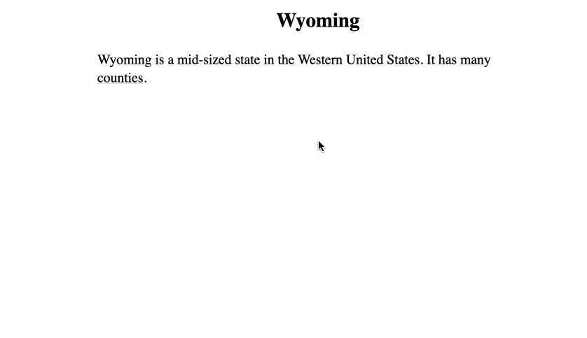

<div align="right">
<a href="https://en.wikipedia.org/wiki/Canopy_(biology)#/media/File:JigsawCanopy.jpg">
</a>
<sub>
  <a rel="nofollow" class="external text" href="https://markfisher.photo">Mark Fisher - markfisher.photo</a>,
  <a href="https://creativecommons.org/licenses/by-sa/3.0" title="Creative Commons Attribution-Share Alike 3.0">CC BY-SA 3.0</a>,
  <a href="https://commons.wikimedia.org/w/index.php?curid=18189052">Link</a>
</sub>
</div>
<div align="center">
<br>


<br>
</div>

## About Canopy JS

### What Canopy does

Canopy takes a set of text files like this:


```
United States: The United States is a country that contains [[New York]] and [[New Jersey]].

New York: New York is a northeastern American state whose capital is [[Albany]].
New York has 20.2 million people, and contains New York City.
New York covers a total area of 54,556 square miles.

Albany: Albany is a mid-sized American city in upstate New York.

New Jersey:   New Jersey is a northeastern American state whose capital is [[Trenton]].
New Jersey has 9.3 million residents. The state was a major site of the American Revolutionary War,
and later became a center of manufacturing and immigration.

Trenton: Trenton is a mid-sized American city in southern New Jersey.

```
<br>
And produces an interactive website like this:
<br>
<br>
<br>


<br>
<br>
<br>
<br>
<br>
<br>
<br>
Traverse the same content in different directions:
<br>
<br>
<br>
<br>


<br>
<br>
<br>
<br>
<br>
<br>

## Why?

A human explainer gives a brief statement that touches on several points and allows the listener to express follow-up questions, adding more detail for someone advanced, or more background information for a beginner. Multiple explanations may mention the same points, but in different contexts and orderings. Even though the same building blocks are being used, you'll never get exactly the same explanation twice.

Canopy allows an author to express their ideas once in small modular pieces, and the web interface combines them produce an infinite number of customized, user-driven explanations.

## Getting Started

### Installation

Install the CLI:

```
npm install -g canopy-js
```

### Starting a project

To start a Canopy project, first create a project directory and enter it:
```
mkdir myProject
cd myProject
```
Then, run the `canopy init` command:
```
canopy init
```
You will be asked for a default topic name, this tells the web application what paragraph to show the user first. It will be stored in the `canopy_default_topic` file in case you need to edit it later.

The init command should create a directory called `topics`, and a file like `myProject/topics/My_Default_Topic.expl`.

A Canopy project is edited by creating new `.expl` files in the project's `topics` directory.

You can run `canopy serve` to see your project live, and can run `canopy watch` to rebuild the content on changes to the `topics` directory.

### Using a Canopy Project

A spoken explanation begins with a brief description of a selected topic, followed by "follow-up" questions or added detail regarding previously mentioned things.

Canopy mimics this "UI," by starting each page with a topic-paragraph that mentions several other ideas, each of which are represented by a link, and selecting that link adds a further paragraph to the page which in turn has further links to further ideas.

The user can begin browsing from multiple original topics, but the links they select may end up taking them to paragraphs that are reused throughout the project.

The URL will reflect the path of paragraphs being displayed, eg `example.com/Topic1#Subtopic1/Topic2#Subtopic2`

### Creating Topic Files

A Canopy website is composed of named paragraphs, some of which are "topics," and some of which are "subtopics."

Topics are standalone "conversation-starters" which can be displayed as the root paragraph of a page, whereas subtopics are paragraphs that are part of a larger topic and should only be displayed at a certain path of paragraphs.

Every topic in a Canopy project gets its own file with a `.expl` extension in the `topics` directory. The name of the file and the directory structure within the `topics` folder do not affect site behavior.

A topic file is composed of a series of paragraph nodes and notes. The first paragraph node represents the topic, and all subsequent paragraph nodes are subtopics of that topic.

A paragraph node begins with a "key," a colon or question-mark terminated text before the paragraph, indicating the "name" of the paragraph. A note is any other text, and notes are ignored by the build process. Paragraph nodes and notes should be separated by two newlines. For example:

```
Topic1: This is the paragraph for Topic1.

Subtopic1: This is a subtopic of Topic1.

This key is a question? And it is also a subtopic of Topic1.

This is a note.

```

Paragraphs or note can span multiple lines and be considered one unit, so long as you do not use a double newline, indicating a new paragraph.

Subtopic paragraphs should have unique names within their enclosing topic file.

### Creating Links

Links or "references" are how it is possible to go from the original topic paragraph to other paragraphs on the page.

There are three types of link, local, global, and import references.

Links are made using the \[\[Link\]\] syntax, and one can change the link text like so: `[[Real Topic|Link Text]].`

#### Local References

A local reference connects a topic to a subtopic, or a subtopic to a subtopic. When a local link is selected, the child paragraph is displayed below the parent, and there is no option to display it on its own as the root of a page. One makes an local reference by referencing a named paragraph in the same file as the reference:

```
Topic1: This is the topic, and this is a link to [[Subtopic1]].

Subtopic1: this is a subtopic defined in the same file as the reference.

```

Subtopics can only be referenced from within the file that they are defined (with the exception of "import references," which will be explained below.)

Within a given topic, a subtopic can only be referenced once because the subtopics of the topics must form a tree, with each paragraph having only one parent reference. If you want to have two references to a given subtopic from multiple other subtopics of that topic, you should probably make the target subtopic a topic proper, or use the "import reference" functionality described below.

The following file:

```
New Jersey: New Jersey is a mid-sized state in the Northeastern United States. The capital of New Jersey is [[Trenton]].

Trenton: Trenton is the capital of New Jersey, and its legislature is housed in the [[New Jersey State House]].

New Jersey State House: The New Jersey State House was built in 1792.
```

Produces the following website:


#### Global References

A global reference connects a topic or subtopic to a different topic. When a global link is selected, the user has the option of appending the new paragraph below the current one, separated by a small divider to indicate the change of topic, or, the user may press "return" or "alt/option-click" and redirect entirely to the topic of the global link. To make a global link, we reference a topic defined in a different file:

```
Topic1: This is a paragraph defined in a file called Topic1.expl.
We are going to reference [[Topic2]], which is defined in a different file.
```

```
Topic2: This is a paragraph defined in a file called Topic2.expl.
When you click on the link above, this paragraph will be displayed.
```

Unlike a subtopic, a topic can be referenced from any paragraph in any file in the project.

Here is an example of how the user can either "inline" global links below the current paragraph, or redirect to the target as a new page.

The following `expl` files in the topics directory:

```
New Jersey: New Jersey is a state in the Northeastern United States. New Jersey has several [[bordering states]].

Bordering states: New Jersey shares its northern border with [[New York]].
```

```
New York: New York is a large state in the Northeastern United States. New Jersey has several [[bordering states]].

Bordering states: New York shares some of its southern border with [[New Jersey]].
```

Produce the following website:
<br>


#### Import references

An import reference is for when you want to reference a subtopic of a given topic, but not from within that topic.

An example might be if you want to express that Fremont county of Idaho is adjacent to Teton county of Wyoming. You would the paragraph for Fremont to reference Teton, however, lets say Teton is a subtopic of Idaho and not a topic-proper. It wouldn't be appropriate to have the paragraph for Teton follow the paragraph for Fremont, because it would lack the context of an explanation of what Wyoming is, and how it relates to Teton.

So, the solution is an "import reference" - the paragraph for "Fremont" would first reference the topic "Wyoming," and then the subtopic of "Teton," and the global link to Wyoming "imports" the subtopics of Wyoming to be available for reference within the current file. When the link for "Teton" is selected, the path from Wyoming's paragraph to the paragraph for Teton is displayed, so that the reference is shown but given the necessary context.

For example, the following files produce this image:

```
Wyoming: Wyoming is a mid-sized state in the Western United States. It has many [[counties]].

Counties: Wyoming contains [[Teton]].

Teton: Teton is a county on the western side of Idaho. Teton borders [[Fremont]] county of [[Idaho]].

```

```
Idaho: Idaho is a mid-sized state in the Western United States. It has many [[counties]].

Counties: Idaho contains [[Fremont]].

Fremont: Fremont is a county on the eastern side of Idaho.
```



In certain rare cases, Canopy may not be able to determine which global link a given import reference belongs to. In these cases, one can use an explicit syntax like this:

```
This is a [[Global Link]], and this is an import reference to a subtopic called "Subtopic": [[Global Link#Subtopic]].

```

### Using Markup

Usual markdown-style styling is generally available, such as lists, code blocks, tables, footnotes, block quotes, and styling characters. Inline HTML is supported. Asterisks indicate bold and underscores indicate italics.

### Using Bulk Mode

It can get tedious to create `expl` files manually, so the CLI has a mode called "bulk mode" that allows the user to edit a text file representing part or all of their project files. A bulk file might look like this:

```
[Category A]

* Topic1: Hello world.

* Topic2: Hello world.

[Category A/Category B]

These are notes.

```

This bulk file would represent the existence of a directory `topics/Category_A` that contained within it two files, `topics/Category_A/Topic1.expl` and `topics/Category_A/Topic2.expl`, and a second directory `topics/Category_A/Category_B` that contained the file `topics/Category_A/Category_B/Category_B.expl`. (Notes that do not have colon or question-mark terminated "key" get put into a "category notes" file named after the enclosing category name, and do not affect the project.)

You can run start `canopy bulk` to start a bulk session in your default editor. If you want to use a visual editor like Sublime Text, you can run `EDITOR='subl -w' canopy bulk` and temporarily change your default editor. When you close the editor, your bulk file will be "processed," updating the file system to reflect the changes you made to the file.

If you want to create a bulk file and edit it at your leisure, processing it at a later point, you can run `canopy bulk --start` to begin, and then `canopy bulk --finish` to process.

If you want to open an editor and make changes in an ongoing fashion, while watching the result in the browser, you can run `canopy bulk --sync`. Saving changes to the file will update your website. It is recommended to use a visual editor for this so that you can see the logs in the terminal.

To load only certain files or directories, use `canopy bulk -pd` for a directory picker, `canopy bulk -pf` for a file picker, and `canopy bulk -pr` to chose directories and all their contents recursively. You can also use `canopy bulk --search STRING` to include topic file paths matching a search string, `canopy bulk --git` to include all files changed relative to the last git commit, `canopy bulk --last` to start a session with the same files you did last time, or `canopy bulk --blank` to start with an empty file.

### Building your project

Run `canopy build` to build JSON files from your `expl` files. Build has a few options. If you are going to host your site at a subdirectory like example.com/subdirectory/Project, then you can build with `canopy build --project-path-prefix "subdirectory"`. If you want to host your site on a static assets server, you can build with hash URLs (eg example.com/#/MyTopic) with `canopy build --hash-urls`, and then host a static assets server pointing at the build directory.

You can use the `canopy build --manual-html` and `--keep-build-directory` options to write your own `index.html` and and incorporate Canopy into it. Canopy.js is expecting a DOM element with the id '\_canopy', and that element should have data attributes called `data-default-topic`, and optionally `data-project-path-prefix`, and `data-hash-urls` if you want to host your project at a path prefix (eg www.example.com/subdirectory/Topic), or if you want to use hash URLs (eg www.example.com/#/Topic).

### Watching your topic files

You can watch your `topics` directory for changes and rebuild the JSON files on change using the `canopy watch` command. Canopy watch should take the same options as build, so that you can specify how you want it to build your project.

### Serving the web interface

You can run a server for your project using `canopy serve` followed by an optional port parameter. Alternatively, you can build with the hash-urls argument option, which allow the site to be hosted with a static assets server.

## Development

For development, clone the repo and run

```
npm install -g [PATH TO REPO]
```

Run webpack to rebuild assets on code changes:

```
npm run develop
```

To build prod assets:
```
npm run build-prod

```

To run tests:
```
npm run test
```

## Contact

At the moment you can submit questions or comments to canopyjs at gmail dot com. For bugs or other issues, open an issue on the project.
